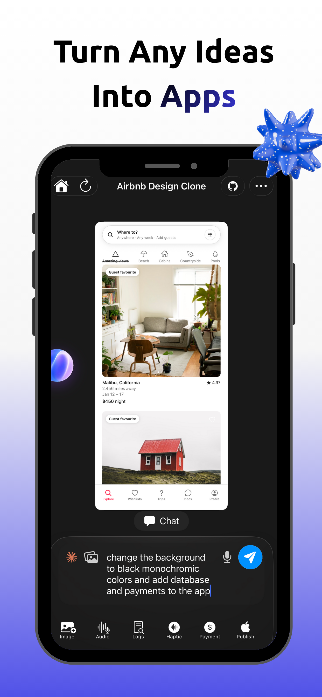
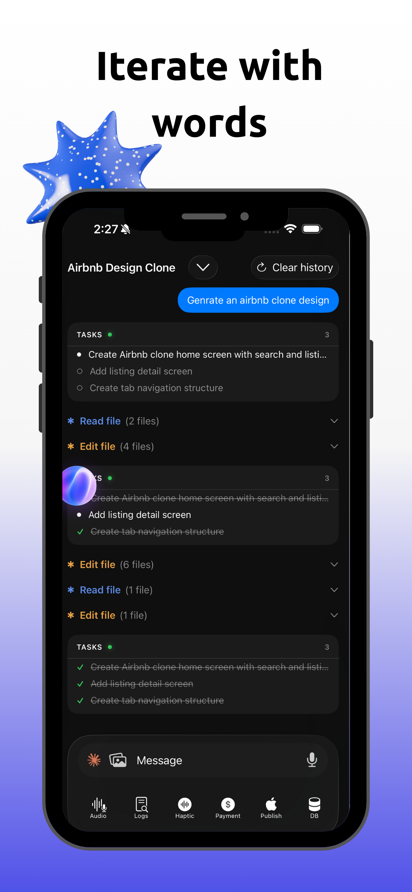
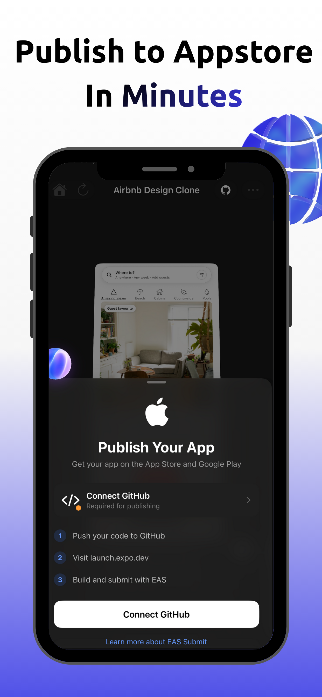
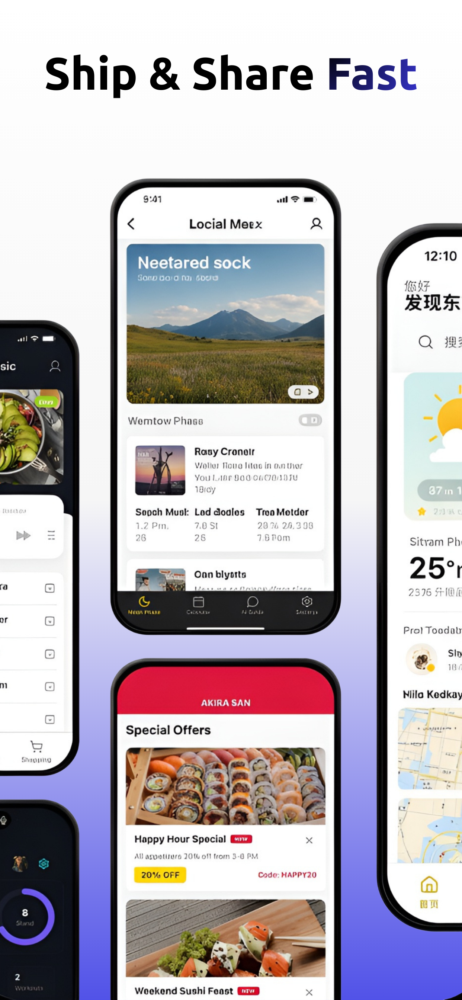
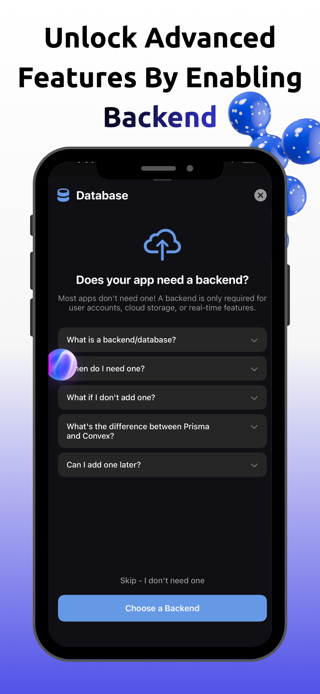
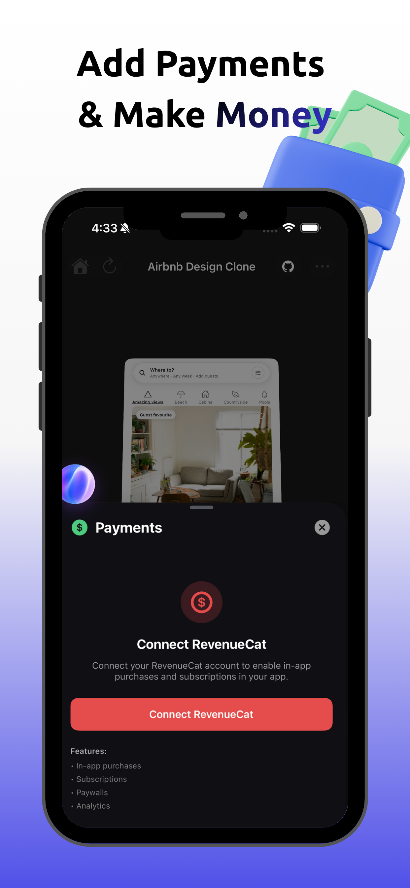

<div align="center">
  <br />
  
  <h1>Vibra Code</h1>
  <h3>Open-Source AI App Builder for Mobile</h3>
  <p>Describe what you want &rarr; AI builds it &rarr; Preview it natively on your phone</p>

  <br />

  <a href="https://apps.apple.com/us/app/vibra-code-ai-app-builder/id6752743077">
    
  </a>
  &nbsp;
  <a href="https://vibracodeapp.com">
    
  </a>
  &nbsp;
  <a href="https://x.com/sehindhemzani">
    
  </a>

  <br /><br />

  [](https://github.com/sa4hnd/vibra-code/stargazers)
  [](./LICENSE)
  [](https://claude.ai/code)

  <br />

  [](https://e2b.dev/startups)

  <sub>E2B sponsored $20K in cloud sandbox credits through their <a href="https://e2b.dev/startups">Startups program</a>.</sub>

</div>

<br />

<div align="center">
  
  
  
  
</div>

<br />

---

## Demos

> **Watch the demos on X:** &nbsp; [Mobile App](https://x.com/SehindHemzani/status/2006879820794499377) &nbsp;|&nbsp; [Website](https://x.com/SehindHemzani/status/2007196039581716917) &nbsp;|&nbsp; [Game built with Vibra Code](https://x.com/SehindHemzani/status/2007187786487787985)

<!-- To embed videos: edit this README on GitHub.com, drag-drop your .mp4 files into the editor, and GitHub will generate embeddable URLs -->

---

## What is Vibra Code?

Vibra Code lets you build mobile apps by describing them in plain English. An AI agent writes the code in a cloud sandbox while you watch in real time. Then you see a live preview -- right on your phone.

This is the **complete source code** behind the app on the [App Store](https://apps.apple.com/us/app/vibra-code-ai-app-builder/id6752743077). Built by one developer with [Claude Code](https://claude.ai/code). Now open source.

<br />

## Why Open Source?

Every other AI app builder is closed-source. You can't see how it works, can't customize it, can't self-host it.

| | **Vibra Code** | [Vibe Code App](https://www.vibecodeapp.com/) | [Rork](https://rork.com/) | [Lovable](https://lovable.dev/) | [Bolt.new](https://bolt.new/) |
|:--|:---:|:---:|:---:|:---:|:---:|
| **Open source** | **Yes** | No | No | No | No |
| **Self-hostable** | **Yes** | No | No | No | No |
| **Custom AI prompts** | **Yes** | No | No | No | No |
| **Swap AI providers** | **Yes** | No | No | No | No |
| **Fork & modify** | **Yes** | No | No | No | No |

> Looking for an **open-source vibe coding app**? This is it. Fork it, self-host it, make it yours.

<br />

## Features

<table>
<tr>
<td width="50%">

**60fps native chat UI** built with Texture + IGListKit. Off-main-thread rendering. No jank.

**Multi-AI providers** -- Claude (default), Cursor, Gemini. Switch with one env var.

**E2B cloud sandboxes** for isolated, safe code execution.

**Real-time sync** via Convex. Changes stream from sandbox to phone instantly.

</td>
<td width="50%">

**Voice & image input** -- describe apps by voice or attach mockup screenshots.

**GitHub integration** -- push generated projects directly to GitHub.

**Web + mobile preview** -- preview both web and mobile apps.

**Built on Expo** -- modified Expo Go gives you full native control.

</td>
</tr>
</table>

<div align="center">
  
  
</div>

<br />

## Architecture

```
  Phone                     Server                        Cloud
┌──────────┐   API    ┌──────────────┐   Queue    ┌──────────────┐
│  Expo    │ ──────── │   Next.js    │ ────────── │  E2B Sandbox │
│  iOS App │          │   + Convex   │   Inngest  │  + AI Agent  │
└────┬─────┘          └──────┬───────┘            └──────┬───────┘
     │                       │                           │
     └───── real-time sync ──┴─── code generation ───────┘
```

1. User describes an app on their phone
2. Backend creates a session in Convex
3. Inngest spawns an E2B sandbox
4. AI agent generates code in the sandbox
5. Updates stream via Convex back to the phone
6. Phone shows a live preview via tunnel URL

<br />

## Quick Start

### Prerequisites

| Required | Purpose |
|----------|---------|
| `ANTHROPIC_API_KEY` | AI code generation (Claude) |
| `E2B_API_KEY` | Cloud sandboxes ([sign up](https://e2b.dev)) |
| Clerk publishable + secret keys | Authentication ([sign up](https://clerk.com)) |
| Convex deployment URL | Real-time database ([sign up](https://convex.dev)) |

> **Stripe** and **RevenueCat** keys are optional -- only needed if you want payments.

### 1. Backend

```bash
cd vibracode-backend
npm install
cp .env.example .env.local    # then add your API keys

npx convex deploy              # deploy database
npx inngest-cli@latest dev     # job server → localhost:8288
npm run dev                    # Next.js → localhost:3000
```

### 2. Build the E2B Sandbox Template

```bash
npm install -g @e2b/cli && e2b auth login
cd vibracode-backend/e2b-cursor-template
e2b template build
# Copy the template ID → set it in config.ts and lib/e2b/config.ts
```

### 3. Mobile App (macOS required)

```bash
git clone --recurse-submodules https://github.com/sa4hnd/vibra-code.git
cd vibra-code/vibracode-mobile

brew bundle                                                # cmake, ninja for Hermes
yarn                                                       # JS dependencies
yarn setup:native                                          # native setup
cd packages/expo && yarn build && cd ../..                 # build Expo
cd react-native-lab/react-native && yarn install && cd ../..   # RN from source
cd apps/expo-go/ios && pod install && cd ../../..          # CocoaPods
cd apps/expo-go && yarn start                              # Metro (must be port 80)
```

Then in Xcode:

1. Open `apps/expo-go/ios/Exponent.xcworkspace`
2. Set `DEV_KERNEL_SOURCE` → `LOCAL` in `EXBuildConstants.plist`
3. Build and run

<details>
<summary>Troubleshooting</summary>

| Problem | Fix |
|---------|-----|
| SHA-1 / symlink errors | `rm -rf ./react-native-lab/react-native/node_modules` |
| C++ build errors | `find . -name ".cxx" -type d -prune -exec rm -rf '{}' +` |
| Everything broken | `git submodule foreach --recursive git clean -xfd` then re-run setup |

</details>

<br />

## Project Structure

```
vibra-code/
├── vibracode-backend/            # Next.js 15 + Convex + Inngest
│   ├── app/api/                  # API routes
│   ├── convex/                   # Database schema & functions
│   ├── lib/inngest/functions/    # Background jobs
│   ├── lib/e2b/                  # Sandbox configuration
│   └── e2b-cursor-template/      # E2B Dockerfile
│
├── vibracode-mobile/             # React Native / Expo
│   └── apps/expo-go/
│       ├── src/screens/          # App screens
│       ├── src/services/         # Business logic
│       └── ios/Client/Menu/      # Native chat UI (Texture + IGListKit)
│
├── expo-template/                # Sandbox app template (submodule)
└── CLAUDE.md                     # AI dev guidelines
```

## Tech Stack

| Layer | Technology |
|-------|-----------|
| **API** | Next.js 15 (App Router) |
| **Database** | Convex (real-time) |
| **Jobs** | Inngest |
| **Sandboxes** | E2B |
| **AI** | Claude Agent SDK / Cursor / Gemini |
| **Auth** | Clerk |
| **Payments** | Stripe + RevenueCat (optional) |
| **Mobile** | React Native / Expo SDK 54 |
| **Chat UI** | Texture + IGListKit (60fps) |

<br />

## Built with Claude Code

This entire project -- backend, mobile app, native iOS UI, infrastructure -- was built by one developer using [Claude Code](https://claude.ai/code).

If you're working on this codebase, Claude Code gives you the best experience. The `CLAUDE.md` has detailed context about every file, pattern, and convention.

## Contributing

PRs welcome. See [CONTRIBUTING.md](./CONTRIBUTING.md).

## License

[AGPL-3.0](./LICENSE) &copy; 2024-2026 Vibra Code contributors.

---

<div align="center">

  Built by **[Sehind Hemzani](https://x.com/sehindhemzani)** &mdash; 19 y/o developer from Kurdistan

  <br />

  <a href="https://x.com/sehindhemzani">
    
  </a>
  &nbsp;
  <a href="mailto:sahindhamzani@gmail.com">
    
  </a>

  <br /><br />

  **If this project is useful, please give it a star** &mdash; it helps others find it.

  [](https://github.com/sa4hnd/vibra-code)

</div>

<!--
SEO: open source AI app builder, vibe coding, vibecodeapp alternative, rork app alternative,
lovable alternative, bolt.new alternative, AI mobile app generator, text to app, prompt to app,
claude code, expo app builder, react native AI, e2b sandbox, self-hosted AI builder
-->
